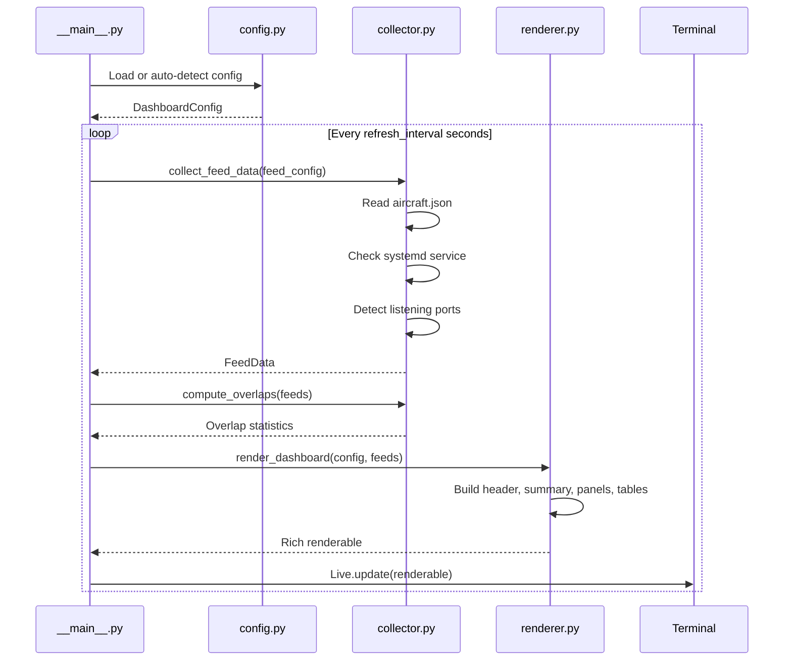
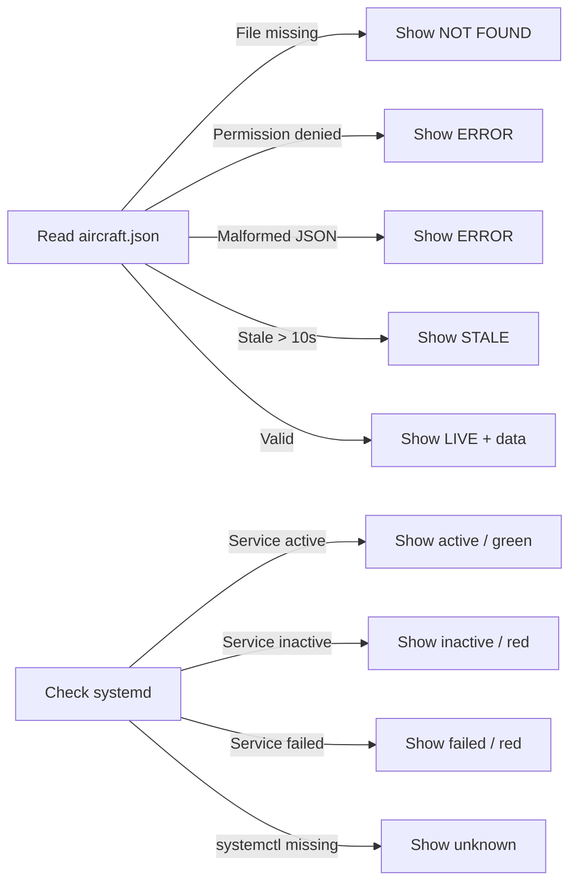

# Architecture

## Overview

readsb-feed-dashboard is a Python application using the Rich library for terminal rendering. It follows a simple collect-render loop architecture.

## Module Structure

```mermaid
graph TD
    A[__main__.py] --> B[config.py]
    A --> C[collector.py]
    A --> D[renderer.py]
    B --> E[/etc/readsb-feed-dashboard.conf]
    B --> F[Auto-detection]
    F --> G[systemd]
    F --> H[/run/readsb*/aircraft.json]
    F --> I[/etc/default/readsb*]
    C --> H
    C --> G
    C --> J[ss / ports]
    D --> K[Rich Library]
    K --> L[Terminal Output]
```

## Data Flow



## Component Responsibilities

### config.py

- Loads JSON configuration files
- Auto-detects readsb instances from filesystem and systemd
- Parses `/etc/default/readsb*` for serial numbers and ports
- Detects terminal Unicode capabilities

### collector.py

- Reads and parses `aircraft.json` files safely
- Handles missing, stale, malformed, or empty JSON
- Queries systemd for service status
- Uses `ss` to detect listening ports per process

### renderer.py

- Builds Rich renderables (Panels, Tables, Columns)
- Computes layout based on number of feeds
- Handles both ASCII and Unicode rendering via Rich's built-in support
- Colour-codes status indicators

### __main__.py

- CLI argument parsing
- Main event loop with Rich Live
- Signal handling for clean exit
- Update mechanism

## Design Decisions

| Decision | Rationale |
|---|---|
| Python + Rich over Bash | Better JSON parsing, error handling, layout management, and Unicode support |
| No curses dependency | Rich handles terminal abstraction more cleanly |
| JSON config format | Easy to generate, parse, and version control |
| Auto-detection as default | Works out-of-the-box on standard readsb setups |
| No database | Stateless — reads current data each cycle |
| No web server | Pure terminal application — simple, secure, low overhead |

## Error Handling Strategy


