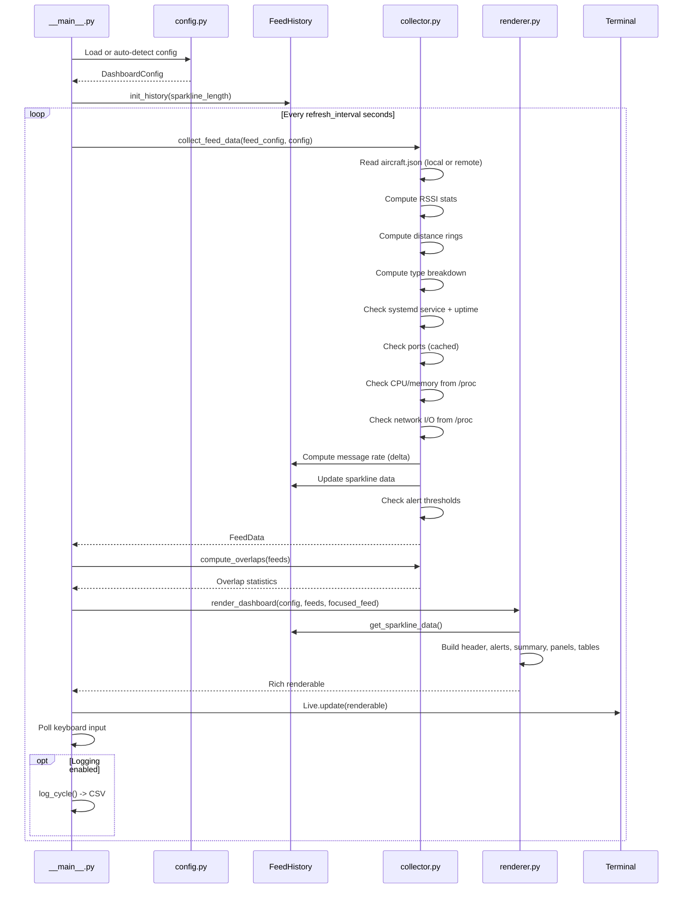
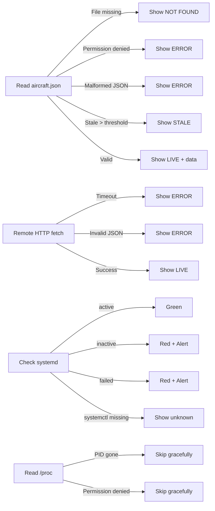

# Architecture

## Overview

readsb-feed-dashboard is a Python application using the Rich library for terminal rendering. It follows a collect-render loop architecture with stateful history for sparklines and rate calculations.

## Module Structure

```mermaid
graph TD
    A[__main__.py] --> B[config.py]
    A --> C[collector.py]
    A --> D[renderer.py]
    B --> E[/etc/readsb-feed-dashboard.conf]
    B --> F[Auto-detection]
    F --> G[systemd]
    F --> H[/run/readsb*/aircraft.json]
    F --> I[/etc/default/readsb*]
    F --> T[tmux/screen detection]
    C --> H
    C --> G
    C --> J[ss / ports]
    C --> K[/proc/PID/status - memory]
    C --> L[/proc/PID/stat - CPU]
    C --> M[/proc/PID/net/dev - network]
    C --> N[Remote HTTP feeds]
    C --> O[FeedHistory - rates + sparklines]
    D --> P[Rich Library]
    P --> Q[Terminal Output]
    A --> R[CSV Logger]
    A --> S[JSON Exporter]
```

## Data Flow



## Component Responsibilities

### config.py

- Loads JSON configuration files
- Auto-detects readsb instances from filesystem and systemd
- Parses `/etc/default/readsb*` for serial numbers and ports
- Detects terminal Unicode capabilities
- Detects tmux/screen for auto-throttling
- Defines colour themes (dark, light, solarised)
- Defines alert configuration

### collector.py

- Reads and parses local `aircraft.json` files safely
- Fetches remote `aircraft.json` over HTTP
- Handles missing, stale, malformed, or empty JSON
- Computes per-feed metrics:
  - Position-tracked aircraft count
  - RSSI min/avg/max statistics
  - Distance ring distribution
  - Aircraft type breakdown (ADS-B, MLAT, TIS-B, Mode-S)
- Queries systemd for service status and uptime
- Detects listening ports (with 30-second cache)
- Reads CPU and memory from `/proc/<pid>/`
- Reads network I/O from `/proc/<pid>/net/dev`
- Maintains `FeedHistory` for message rate calculation and sparkline data
- Checks alert thresholds

### renderer.py

- Builds Rich renderables (Panels, Tables, Columns)
- Renders sparkline graphs from history data
- Colour-codes RSSI values (green/yellow/red)
- Applies configurable themes
- Supports configurable sort order
- Supports focused single-feed view
- Supports compact mode (no aircraft tables)
- Renders alerts panel when thresholds are breached

### __main__.py

- CLI argument parsing (15+ flags)
- Main event loop with Rich Live
- Non-blocking keyboard input handling (select + termios)
- Signal handling for clean exit
- CSV logging per cycle
- JSON export mode
- Watchdog mode for monitoring integration
- Update mechanism

## Keyboard Input Architecture

```mermaid
flowchart TD
    A[Main Loop Tick] --> B[Collect + Render]
    B --> C[Poll stdin with select()]
    C -->|Key pressed| D{Which key?}
    C -->|Timeout| A

    D -->|q| E[Exit]
    D -->|s| F[Toggle compact mode]
    D -->|f| G[Cycle sort order]
    D -->|1-9| H[Focus feed N]
    D -->|0| I[Reset to all-feeds view]

    F --> J[Force re-render]
    G --> J
    H --> J
    I --> J
    J --> A
```

## Caching Strategy

| Data | Cache TTL | Rationale |
|---|---|---|
| Listening ports | 30 seconds | Ports rarely change |
| Service status | 0 (every cycle) | Can change at any time |
| Aircraft JSON | 0 (every cycle) | Core data, must be fresh |
| Process stats | 0 (every cycle) | Useful for live monitoring |
| Network I/O | 0 (computed as delta) | Needs continuous sampling |

## Design Decisions

| Decision | Rationale |
|---|---|
| Python + Rich over Bash | Better JSON parsing, error handling, layout, Unicode support |
| No curses dependency | Rich handles terminal abstraction more cleanly |
| JSON config format | Easy to generate, parse, and version control |
| Auto-detection as default | Works out-of-the-box on standard readsb setups |
| FeedHistory as module singleton | Maintains state across refresh cycles without global mutable state |
| Port cache with TTL | Avoids shelling out to ss every 2 seconds |
| select() for keyboard | Non-blocking input without threads |
| No database | Stateless reads + lightweight in-memory history |
| No web server | Pure terminal — simple, secure, low overhead |

## Error Handling Strategy


