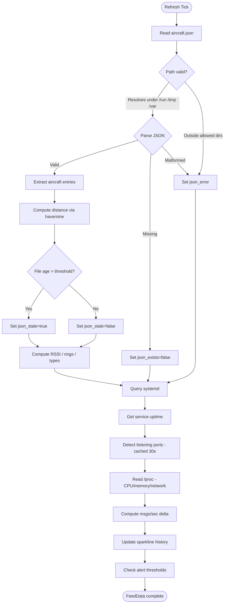
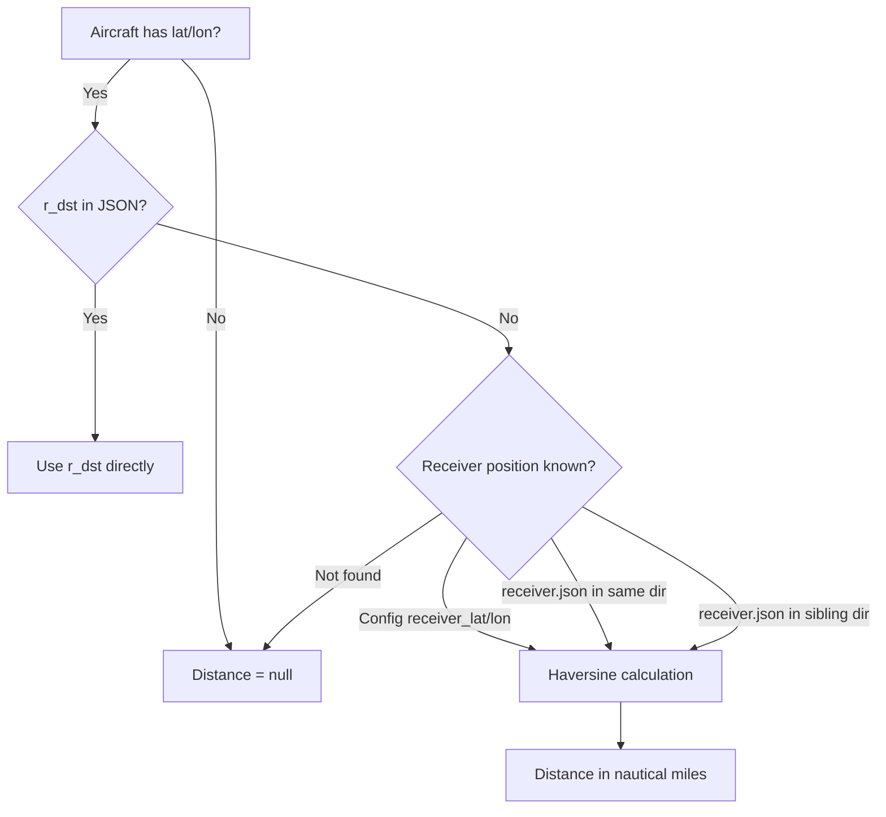
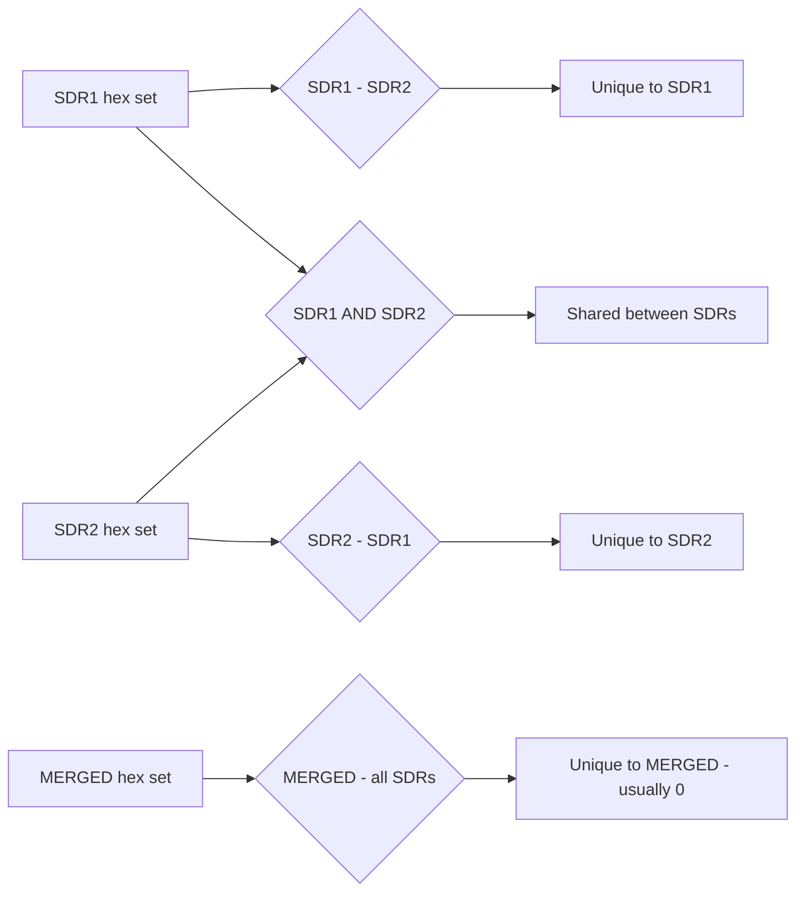
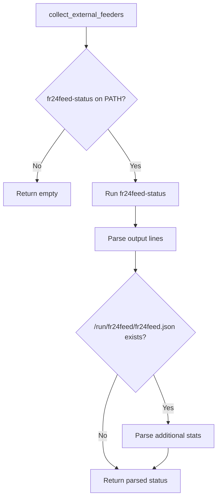
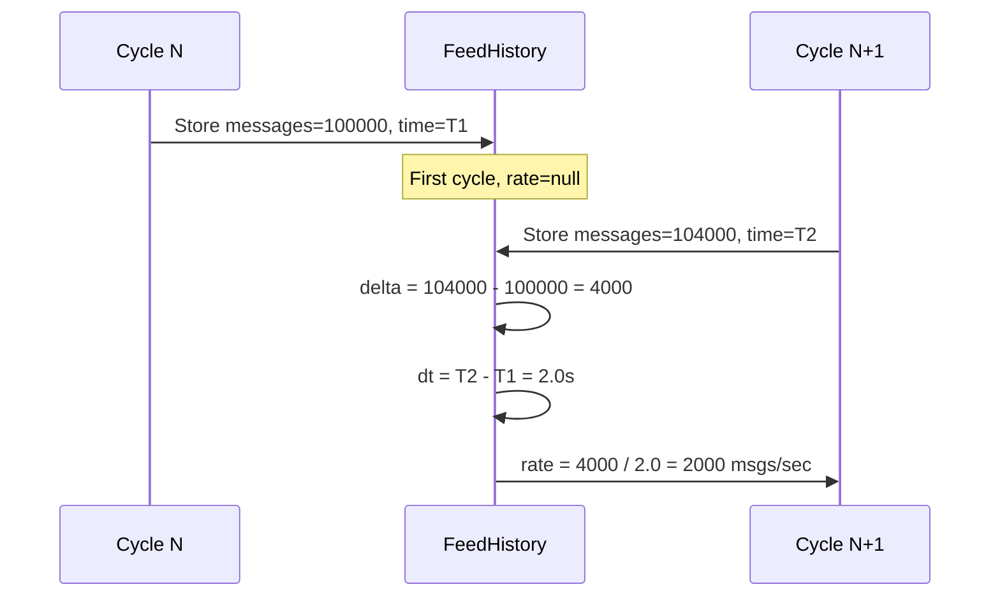

# Data Flow

Detailed data flow documentation for readsb-feed-dashboard.

## Collection Cycle

Each refresh cycle performs the following operations per feed:



## Distance Calculation



## Overlap Computation

For "unique" counts, SDR feeds are compared against other SDR feeds only (the merge feed is excluded since it contains everything):



For N SDR feeds:
- `unique_to[i]` = aircraft seen by SDR i but not by any other SDR
- `shared[i][j]` = aircraft seen by both feed i and feed j
- `total_unique` = union of all hex sets across all feeds

## External Feeder Collection



## JSON Schema (aircraft.json)

readsb writes the following structure:

```json
{
  "now": 1705312327.4,
  "messages": 123456,
  "aircraft": [
    {
      "hex": "4ca87d",
      "type": "adsb_icao",
      "flight": "RYR3456 ",
      "alt_baro": 37000,
      "alt_geom": 37425,
      "gs": 482.3,
      "track": 127.4,
      "squawk": "2431",
      "rssi": -3.2,
      "lat": 51.234,
      "lon": -1.456,
      "r_dst": 42.1,
      "seen": 0.3,
      "seen_pos": 1.2
    }
  ]
}
```

## Fields Used by Dashboard

| JSON Field | Dashboard Column | Notes |
|---|---|---|
| `hex` | Hex | ICAO 24-bit address |
| `flight` | Flight | Callsign (may have trailing spaces, trimmed) |
| `alt_baro` | Alt | Barometric altitude in feet |
| `gs` | Spd | Ground speed in knots |
| `rssi` | RSSI | Signal strength in dBFS (colour-coded) |
| `squawk` | Sqk | Transponder squawk code |
| `r_dst` | Dist | Distance from receiver in nautical miles |
| `lat`/`lon` | (used for distance) | Aircraft position |
| `seen` | Seen | Seconds since last message (1 decimal) |
| `type` | Type | Message type (adsb_icao, mlat, tisb, mode_s) |
| `messages` | (used for rate) | Total message count for msgs/sec calculation |

## Message Rate Computation


