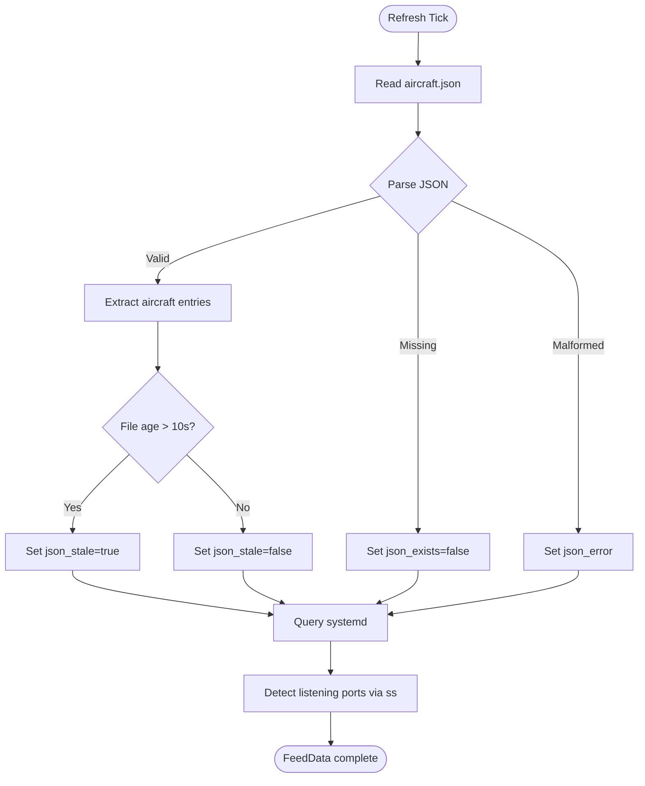
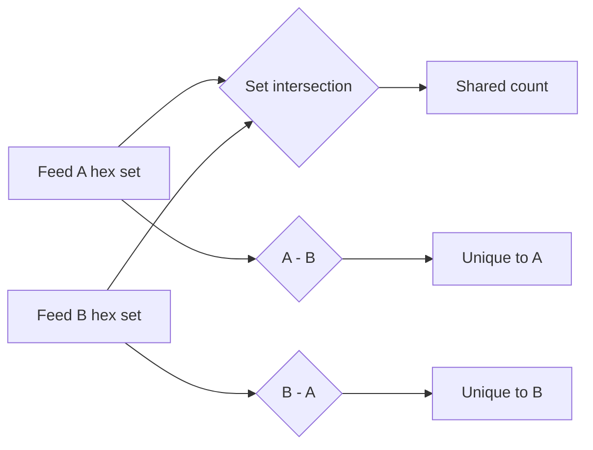

# Data Flow

Detailed data flow documentation for readsb-feed-dashboard.

## Collection Cycle

Each refresh cycle performs the following operations per feed:



## Overlap Computation



For N feeds, we compute:
- `unique_to[i]` = aircraft in feed i but not in any other feed
- `shared[i][j]` = aircraft in both feed i and feed j
- `total_unique` = union of all hex sets across all feeds

## JSON Schema (aircraft.json)

readsb writes the following structure:

```json
{
  "now": 1705312327.4,
  "messages": 123456,
  "aircraft": [
    {
      "hex": "4ca87d",
      "type": "adsb_icao",
      "flight": "RYR3456 ",
      "alt_baro": 37000,
      "alt_geom": 37425,
      "gs": 482.3,
      "track": 127.4,
      "squawk": "2431",
      "rssi": -3.2,
      "lat": 51.234,
      "lon": -1.456,
      "r_dst": 42.1,
      "seen": 0.3,
      "seen_pos": 1.2
    }
  ]
}
```

## Fields Used by Dashboard

| JSON Field | Dashboard Column | Notes |
|---|---|---|
| `hex` | Hex | ICAO 24-bit address |
| `flight` | Flight | Callsign (may have trailing spaces) |
| `alt_baro` | Alt (ft) | Barometric altitude in feet |
| `gs` | Spd (kt) | Ground speed in knots |
| `rssi` | RSSI | Signal strength in dBFS |
| `squawk` | Squawk | Transponder squawk code |
| `r_dst` | Dist (nm) | Distance from receiver in nautical miles |
| `seen` | Seen (s) | Seconds since last message from this aircraft |
