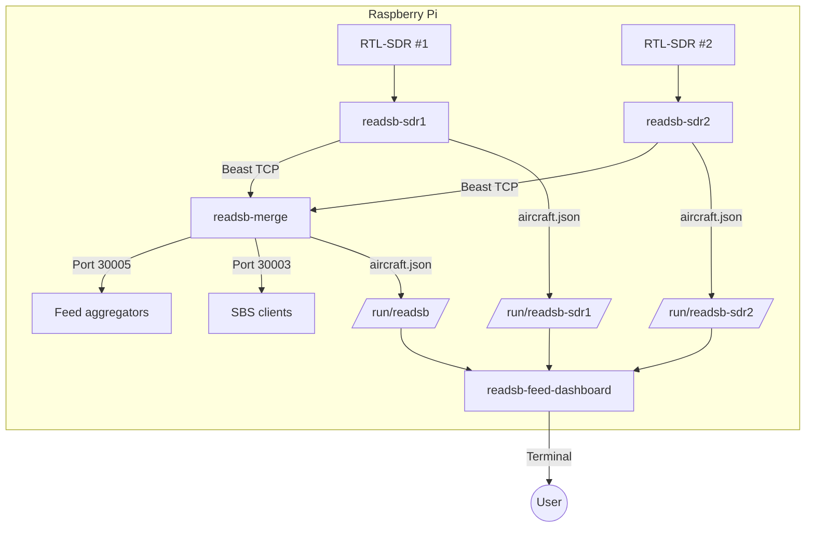
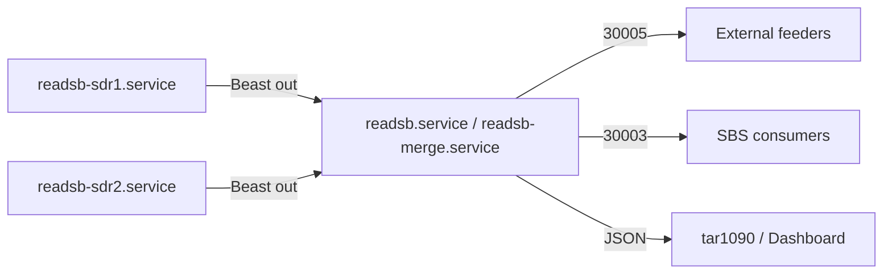

# Deployment

## Standard Deployment (Single Pi)

## Multi-Pi Deployment (Future)

```mermaid
graph TD
    subgraph "Pi A (Rooftop)"
        SDRA[RTL-SDR] --> RSA[readsb-sdr1]
        RSA -->|Beast TCP :30005| Network
    end

    subgraph "Pi B (Ground)"
        SDRB[RTL-SDR] --> RSB[readsb-sdr2]
        RSB -->|Beast TCP :30005| Network
    end

    subgraph "Pi C (Merge Server)"
        Network -->|net-connector| RMC[readsb-merge]
        RMC -->|aircraft.json| Dashboard[readsb-feed-dashboard]
    end
```

## Service Dependencies

## Port Allocation Convention

| Service | Beast Out | SBS Out | Beast Reduce |
|---|---|---|---|
| readsb-sdr1 | 30105 | - | - |
| readsb-sdr2 | 30205 | - | - |
| readsb-sdr3 | 30305 | - | - |
| readsb / merge | 30005 | 30003 | 30006 |
