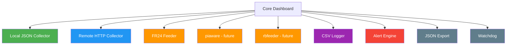

# Extending

## Adding a New Feed

Simply add an entry to the `feeds` array in your config file:

```json
{
  "label": "SDR3",
  "json_path": "/run/readsb-sdr3/aircraft.json",
  "service_name": "readsb-sdr3",
  "feed_type": "sdr",
  "beast_port": 30305,
  "sbs_port": null,
  "serial": "12345678"
}
```

No code changes required — the dashboard dynamically handles any number of feeds.

## Adding New Data Fields

To display additional aircraft fields:

1. Add the field to `AircraftEntry` in `collector.py`
2. Parse it in `_read_json()` in `collector.py`
3. Add a column in `build_aircraft_table()` in `renderer.py`

## Adding a New Panel

1. Create a new `build_*_panel()` function in `renderer.py`
2. Call it from `render_dashboard()` and append to the renderables list

## Adding a New External Feeder

The `feeders.py` module handles external feeder detection. To add support for a new feeder (e.g. piaware, rbfeeder):

1. Create a dataclass for the feeder's status (like `FR24Status`)
2. Add a detection/collection function (like `_collect_fr24`)
3. Add the field to `ExternalFeeders`
4. Call it from `collect_external_feeders()`
5. Add a panel builder in `renderer.py`
6. Call the panel builder from `render_dashboard()`

Example skeleton for piaware:

```python
@dataclass
class PiawareStatus:
    available: bool = False
    process_running: bool = False
    connected_to_flightaware: bool = False
    aircraft_reported: Optional[int] = None

def _collect_piaware() -> Optional[PiawareStatus]:
    if not _command_exists("piaware-status"):
        return None
    # Parse piaware-status output...
```

## Custom Colour Schemes

Edit the `THEMES` dictionary in `config.py`:

```python
THEMES = {
    "dark": {
        "active": "green",
        "inactive": "red",
        ...
    },
    "my_custom_theme": {
        "active": "#00ff00",
        "inactive": "#ff0000",
        ...
    },
}
```

Rich supports any [Rich colour string](https://rich.readthedocs.io/en/latest/appendix/colors.html) including hex codes.

## Architecture for Extensions



## Built-in Features (No Extension Needed)

These features are already implemented — no code changes required:

| Feature | How to use |
|---|---|
| Remote feeds | Add `json_url` to config |
| Alerts | Add `alerts` block to feed config |
| CSV logging | Use `--log` flag or `log_path` config |
| JSON export | Use `--export json` |
| Watchdog | Use `--watchdog` |
| Custom sort | Use `--sort` flag or `sort_by` config |
| Compact mode | Use `--compact` flag or press `s` |
| Focus single feed | Press `1`, `2`, `3`, etc. |
| FR24 status | Auto-detected if `fr24feed-status` is on PATH |

## Contributing

1. Fork the repository
2. Create a feature branch
3. Make your changes
4. Ensure service names and paths are validated (see security.md)
5. Run tests: `python3 -m pytest`
6. Submit a pull request
