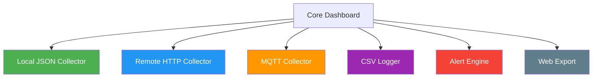

# Extending

## Adding a New Feed

Simply add an entry to the `feeds` array in your config file:

```json
{
  "label": "SDR3",
  "json_path": "/run/readsb-sdr3/aircraft.json",
  "service_name": "readsb-sdr3",
  "feed_type": "sdr",
  "beast_port": 30305,
  "sbs_port": null,
  "serial": "12345678"
}
```

No code changes required — the dashboard dynamically handles any number of feeds.

## Adding New Data Fields

To display additional aircraft fields:

1. Add the field to `AircraftEntry` in `collector.py`
2. Parse it in `_read_json()` in `collector.py`
3. Add a column in `build_aircraft_table()` in `renderer.py`

## Adding a New Panel

1. Create a new `build_*_panel()` function in `renderer.py`
2. Call it from `render_dashboard()` and append to the renderables list

## Remote Feeds

For monitoring a remote readsb instance, you could extend the collector to fetch JSON over HTTP:

```python
import urllib.request

def _read_json_remote(url: str) -> dict:
    """Fetch aircraft.json from a remote tar1090/readsb web interface."""
    with urllib.request.urlopen(url, timeout=5) as resp:
        return json.loads(resp.read())
```

Config addition:

```json
{
  "label": "REMOTE-PI",
  "json_url": "http://192.168.1.50/tar1090/data/aircraft.json",
  "feed_type": "sdr"
}
```

## Historical Data / Logging

To add logging of aircraft counts over time:

```python
import csv
from datetime import datetime

def log_counts(feeds: list[FeedData], log_path: str = "/var/log/readsb-dashboard.csv"):
    """Append current counts to a CSV log."""
    now = datetime.now().isoformat()
    with open(log_path, "a", newline="") as f:
        writer = csv.writer(f)
        for feed in feeds:
            writer.writerow([now, feed.config.label, feed.aircraft_count])
```

## Alerting

To add alerts when aircraft count drops to zero or a service goes down:

```python
import subprocess

def check_alerts(feeds: list[FeedData]):
    """Send a desktop notification if a feed goes down."""
    for feed in feeds:
        if feed.service_active == "failed":
            subprocess.run([
                "notify-send", "--urgency=critical",
                f"readsb-feed-dashboard: {feed.config.label} FAILED"
            ])
```

## Custom Colour Schemes

Edit the colour constants at the top of `renderer.py`:

```python
COLOUR_ACTIVE = "green"
COLOUR_INACTIVE = "red"
COLOUR_STALE = "yellow"
COLOUR_TITLE = "bold cyan"
```

Rich supports any [Rich colour string](https://rich.readthedocs.io/en/latest/appendix/colors.html).

## Architecture for Extensions



## Contributing

1. Fork the repository
2. Create a feature branch
3. Make your changes
4. Run tests: `python3 -m pytest`
5. Submit a pull request
